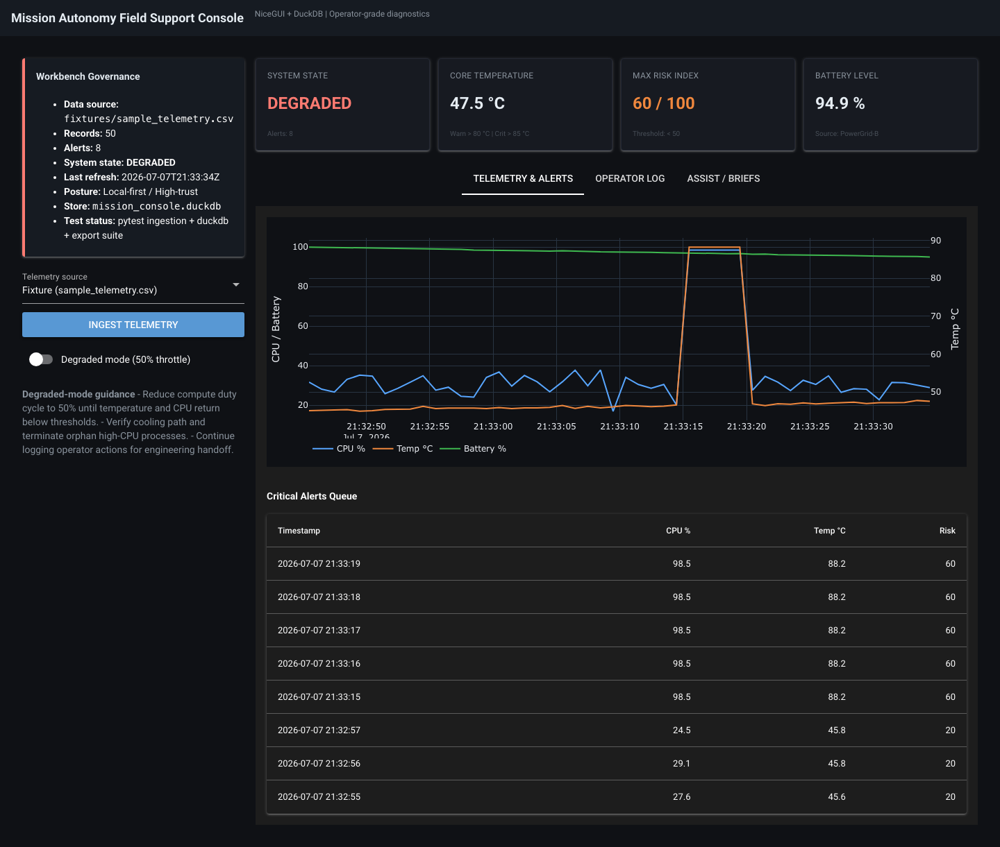
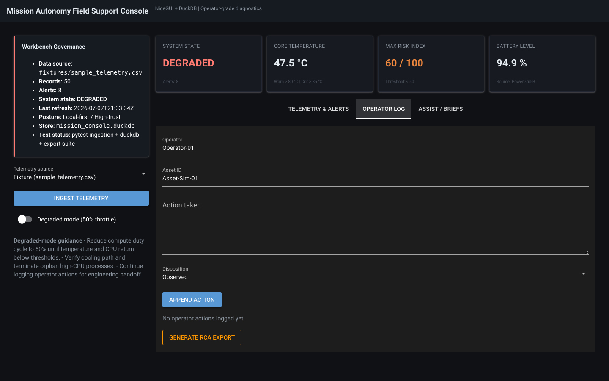
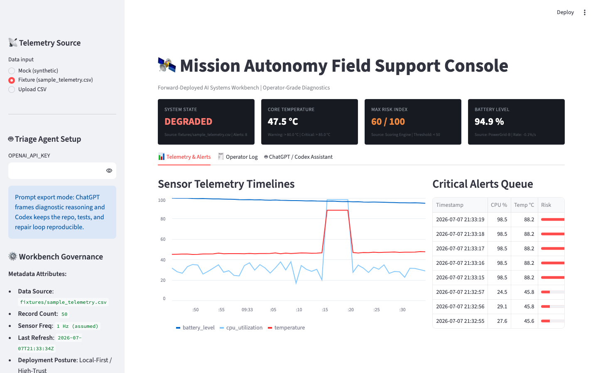

# Forward-Deployed AI Systems Workbench

**Repository:** https://github.com/charlesdegen/forward-deployed-ai-workbench

This repository is a local-first build environment and template designed for converting ambiguous operational problems into working software, decision surfaces, evaluation harnesses, and deployable artifacts. It is optimized for an OpenAI build loop where **ChatGPT** turns mission ambiguity into architecture, specs, eval plans, and review checklists, while **Codex** works repo-native to implement changes, run tests, inspect failures, and produce deployable artifacts.

The workbench can still host other model providers or agent runtimes, but the default operating doctrine is:

- **ChatGPT as mission architect**: clarify the operator problem, draft acceptance criteria, generate Mermaid diagrams, prepare eval rubrics, pressure-test assumptions, and convert field notes into implementation briefs.
- **Codex as implementation agent**: edit this repository, add tests, run `pytest`/`ruff`, repair broken code paths, summarize diffs, and keep the artifact reproducible from local files.
- **Human as mission owner**: define constraints, approve operational tradeoffs, validate outputs against real users, and decide when the artifact is ready to hand to an operator or engineering team.

## Getting Started

### 1. Open the Workspace in Codex
Open this repository as the active Codex workspace:
`/Users/charlesdegen/Documents/forward-deployed-ai-workbench`

Use ChatGPT for higher-level shaping prompts such as:

```text
Turn this operator workflow into acceptance criteria, a data contract, a test plan, and a Codex-ready build brief.
```

Use Codex for repo-bound execution prompts such as:

```text
Implement the build brief, add focused tests, run the test suite, and summarize the resulting changes.
```

### 2. Configure Environment
Create a `.env` file in the root of this repository if you want to prepare for OpenAI-backed assistant features:
```bash
OPENAI_API_KEY="your_api_key_here"
```

The starter app runs in prompt export mode: it generates high-context ChatGPT and Codex briefs, but does not make live API calls yet. Local telemetry generation, anomaly scoring, charts, alert queues, operator action logging, and fallback triage checklists all run offline.

### 3. Initialize Python Environment
```bash
python -m venv .venv
source .venv/bin/activate
pip install -r requirements.txt
```

### 4. Run the Local Data Fusion Workbench (Polars + DuckDB)
```bash
python local-data-fusion-workbench/fusion/apps/nicegui_app.py
```
Open `http://127.0.0.1:8081` — fixture customers/transactions load on startup. See [local-data-fusion-workbench/README.md](local-data-fusion-workbench/README.md).

### 4a. Run the Mission Console (NiceGUI + DuckDB)
```bash
python src/apps/nicegui_app.py
```
Open `http://127.0.0.1:8080` — fixture telemetry loads into local DuckDB on startup.

### 4b. Run the Streamlit Starter (legacy surface)
```bash
streamlit run src/apps/streamlit_app.py
```

### 5. Verify the Starter
```bash
./scripts/verify.sh
```

## Screenshots

### Mission Console (NiceGUI + DuckDB)

Portfolio artifact #1 — operator-grade diagnostics with DuckDB-backed alerts, governance metadata, and degraded-mode guidance.



*Fixture ingest, governance panel, DEGRADED state, Plotly telemetry timelines, and SQL-backed critical alerts queue.*



*Operator action log tab with append form and RCA packet export for engineering handoff.*

### Streamlit starter

Lighter starter surface for prompt-export triage loops.



Regenerate screenshots after UI changes (requires `playwright` in the active venv):

```bash
pip install playwright
playwright install chromium
python scripts/capture_screenshots.py
```

## Optional Agent Adapters

ChatGPT and Codex are the default workflow for this repository. Other agent CLIs can be used as optional adapters when you want to compare build loops or run the same doctrine in another tool.

### Grok Build Adapter

Install the Grok Build CLI (macOS/Linux):

```bash
curl -fsSL https://x.ai/cli/install.sh | bash
grok --version
```

Authenticate on first launch via browser login, or set `XAI_API_KEY` for headless/CI use.

Launch in this repository with the Grok Build model:

```bash
grok -m grok-build --cwd /Users/charlesdegen/Documents/forward-deployed-ai-workbench
```

Attach file context with `@` references in prompts (e.g. `@specs/product_brief.md`, `@src/core/ingestion.py`, `@tests/`).

Use Grok for repo-bound execution prompts such as:

```text
Implement the build brief in @specs/product_brief.md, add focused tests, run pytest, and summarize git diff.
```

Optional sandbox profile for everyday development (read everywhere, write CWD + `~/.grok` + temp dirs):

```bash
grok --sandbox workspace -m grok-build --cwd /Users/charlesdegen/Documents/forward-deployed-ai-workbench
```

Full optional operating doctrine: see [GROKBUILD_DOCTRINE.md](GROKBUILD_DOCTRINE.md).

## Repository Structure

-   `AGENTS.md`: Shared agent rules loaded by Codex, Grok Build, and Claude Code — local-first constraints, verification gates, adapter routing.
-   `CLAUDE.md`: Claude Code session rules (mirrors `AGENTS.md`).
-   `GAP_ANALYSIS.md`: Living gap analysis — repo fidelity vs. doctrine and priority roadmap.
-   `scripts/verify.sh`: Verification gate — pytest, ruff, py_compile, fixture check.
-   `GROKBUILD_DOCTRINE.md`: GrokBuild manifesto — FDE doctrine, toolchain layers, governance, and Grok Build quick-reference.
-   `CLAUDEBUILD_DOCTRINE.md`: Optional Claude-oriented doctrine for comparison workflows.
-   `/specs`: `product_brief.md`, `data_contract.md`, `acceptance_criteria.md`, `operator_workflow.md`, `threat_model.md`.
-   `/prompts`: ChatGPT, Codex, Grok Build, and Claude Code build/repair briefs.
-   `/skills`: Directory containing filesystem-based agent skills and Codex-readable operating guidance (e.g. `triage-skill`).
-   `/src/core`: Core analytical modules (data ingestion, scoring, transformations).
-   `/src/apps`: `nicegui_app.py` (Mission Console, DuckDB-backed) and `streamlit_app.py` (starter).
-   `src/core/duckdb_store.py`: Local DuckDB persistence and SQL alert queries.
-   `/artifacts`: `screenshots/` (README captures), local operator logs, and `exports/` RCA packets.
-   `/evals`: Artifact, security, and field-readiness scorecard templates.
-   `/fixtures`: Sample datasets (telemetry logs, CSV extracts) for testing.
-   `src/schemas/`: JSON Schema contracts for telemetry input, scored output, and RCA packets.
-   `/tests`: pytest suites including `golden_outputs/` regression.

## ChatGPT / Codex Workflow

1.  **Frame with ChatGPT**: Convert messy field context into a product brief, threat model, acceptance criteria, eval rubric, and demo script.
2.  **Build with Codex**: Ask Codex to implement from the brief, preserve existing repo patterns, add tests near the changed behavior, and run verification commands.
3.  **Review with ChatGPT**: Paste or upload the resulting diff, screenshots, and test output for architecture review, operator-readiness critique, and missing-risk analysis.
4.  **Repair with Codex**: Feed the review back into Codex as a targeted repair brief: specific defects, files, expected behavior, and verification commands.
5.  **Package the artifact**: Produce a local app, single-file HTML export, screenshot set, README, demo script, and evaluation scorecard.

## Optional Grok Build Workflow

Grok Build is xAI's terminal-native agent: it reads this repo, runs shell commands, applies line-precise diffs, spawns parallel subagents, and validates changes in a real local environment. Use it as the acceleration layer inside the same FDE loop — Grok compresses ambiguity; the human owns mission judgment and sign-off.

1.  **Frame with Grok**: Convert messy field context into a product brief, threat model, acceptance criteria, eval rubric, and demo script. For multi-component systems, use `/design <description>` to run a writer→reviewer loop that produces an architecture spec and PR-plan DAG.
2.  **Plan when ambiguous**: Use `/plan` or plan mode (`Shift+Tab`) when the right approach is unclear (auth model, data pipeline shape, deployment path). Grok writes `plan.md` for approval before editing code.
3.  **Build with Grok Build**: Attach context via `@` file references and ask Grok to implement from the brief. Grok scaffolds code, runs `pytest`/`ruff`, and repairs failures via execution feedback. Use `grok --worktree=<name>` for isolated artifact branches.
4.  **Verify before demo**: Run `/check-work [focus]` to spawn a verifier subagent that reviews diffs, runs builds/tests, and gates ship readiness.
5.  **Review before handoff**: Run `/review --local` for a read-only review artifact before operator delivery or engineering feedback.
6.  **Package the artifact**: Produce a local app, single-file HTML export, screenshot set, README, demo script, and evaluation scorecard. Use `git diff` to summarize changes for RCA packets.

**Bundled orchestration skills** (slash commands):

| Skill | Command | Use when |
|---|---|---|
| Design | `/design <description>` | Architecture spec + PR-plan DAG needed |
| Execute plan | `/execute-plan <design-doc>` | Multi-PR stack from a design doc |
| Check work | `/check-work [focus]` | Mandatory verify gate before demo |
| Review | `/review --local` | Pre-handoff diff review |

**Grok / human role split**

- **Grok**: requirement decomposition, architecture & Mermaid diagrams, code scaffolding, test generation, diff analysis, eval design, README/demo narrative, sandbox validation.
- **Human**: choose mission, define acceptance criteria, control data exposure, approve plans, set permission/sandbox mode, judge UX usefulness, decide when to ship, own the operational narrative.

## Codex-Ready Build Brief Template

```text
Goal:
Build or repair [artifact] for [operator workflow].

Constraints:
- Local-first; no external database required.
- Separate computation from UI.
- Keep changes scoped to the existing repo structure.
- Add tests for scoring, parsing, or export behavior.
- Preserve offline fallback behavior when no API key is present.

Inputs:
- Product brief: specs/product_brief.md
- Skill guidance: skills/triage-skill/SKILL.md
- Starter app: src/apps/streamlit_app.py
- Core logic: src/core/ingestion.py

Acceptance:
- App runs with `streamlit run src/apps/streamlit_app.py`.
- Tests pass with `pytest`.
- README explains how ChatGPT and Codex are used in the build loop.
```

## Grok Build Task Brief Template

```text
You are Grok assisting modification of this Forward-Deployed AI Systems Workbench repository.

Mission: [One-sentence objective]

Operational context: [Who uses this, under what constraints, what decision/workflow it supports]

Files to inspect first:
- README.md
- GROKBUILD_DOCTRINE.md
- specs/product_brief.md
- skills/triage-skill/SKILL.md
- src/
- tests/

Grok Build invocation hints:
- Attach context: @specs/product_brief.md @src/core/ @tests/
- Run verification: pytest, ruff check
- After edits: /check-work [focus area]
- Before handoff: /review --local

Implementation requirements:
- [requirement 1]
- [requirement 2]
- [requirement 3]

Acceptance criteria:
- App runs locally with documented command
- Tests pass with pytest
- No unnecessary dependencies
- Core logic separated from UI
- Sample fixtures included
- README updated with Grok-generated sections clearly marked
- Known limitations documented
- Governance fields populated (data source, assumptions, model usage, test status)

Do not:
- Introduce cloud dependencies
- Hardcode secrets
- Remove existing tests
- Add large frameworks unless justified

Deliver:
- Changed files summary
- Commands run (or sandbox validation steps)
- Test results
- git diff summary
- Known gaps
- Suggested next leverage point
```
