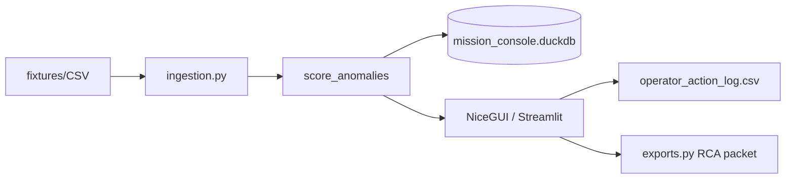
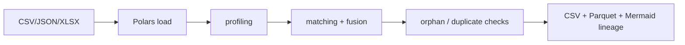

# Architecture

## Portfolio map

```
forward-deployed-ai-workbench/          # umbrella
├── src/                                # #1 Mission Autonomy (core + Streamlit + NiceGUI)
├── local-data-fusion-workbench/        # #2 Polars + DuckDB fusion
├── financial-crime-ops-console/        # #3 AML case workflow
├── llm-red-team-eval-harness/          # #4 security eval suite
└── single-file-command-briefs/         # #5 zero-install HTML brief
```

## Layering (all Python artifacts)

| Layer | Responsibility | Location pattern |
|---|---|---|
| Core | Ingest, validate, score, persist, export | `*/core/` or `src/core/` |
| Apps | Operator UI only | `*/apps/` or `src/apps/` |
| Fixtures | Synthetic data | `fixtures/` |
| Specs | Product brief, contracts | `specs/` |
| Tests | pytest near behavior | `tests/` |
| Artifacts | Runtime DB, exports, screenshots | `artifacts/` (gitignored runtimes) |

## Shared principles

1. **Local-first** — DuckDB files and CSVs; no required cloud DB.
2. **Logic vs UI** — thresholds and packets never live only in Streamlit/NiceGUI widgets.
3. **Governance on the surface** — data source, refresh, assumptions, model usage, test status.
4. **Offline fallback** — demos run without API keys.
5. **Verify gate** — `./scripts/verify.sh` collects mission + portfolio tests.

## Data flow (Mission Console)



## Data flow (Data Fusion)


