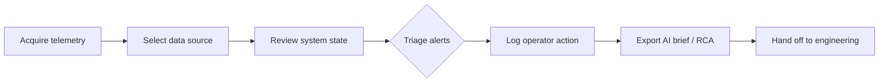

# Operator Workflow: Field Telemetry Triage

**Persona:** Field Operations Engineer (FDE) or edge operator  
**Environment:** Degraded connectivity, local laptop, no cloud dependency  
**Console:** `streamlit run src/apps/streamlit_app.py`

## Workflow overview

## Step 1 — Acquire telemetry

| Source | When to use | Action |
|---|---|---|
| Fixture | Demo, training, CI smoke | Select **Fixture (sample_telemetry.csv)** |
| Upload | Real field extract | Select **Upload CSV**, attach `telemetry.csv` |
| Mock | No file available | Select **Mock (synthetic)** |

Invalid CSV (missing columns) blocks scoring and shows schema error — do not proceed with partial data.

## Step 2 — Assess system state

1. Read **System State** metric: `NOMINAL` or `DEGRADED`.
2. Check **Core Temperature** against warning (80 °C) and critical (85 °C) bands.
3. Review **Max Risk Index** — values above 50 warrant escalation.
4. Confirm **Data Source** and **Last Refresh** in governance sidebar match the ingest you expect.

## Step 3 — Triage alerts (priority order)

Follow `skills/triage-skill/SKILL.md`:

1. **Safety & power** — temperature, battery depletion rate
2. **Communications** — `comms_link` below 80 %
3. **Sensor alignment** — `sensor_drift` above 0.3
4. **Compute & software** — `cpu_utilization` above 85 %

In the **Telemetry & Alerts** tab:

- Use timeline chart for trend context.
- Work the **Critical Alerts Queue** newest-first.
- Cross-check numeric values before taking field action.

## Step 4 — Log operator actions

In the **Operator Log** tab:

1. Enter operator ID and asset ID.
2. Describe action taken (observation, mitigation, escalation).
3. Set disposition: Observed → Mitigated → Escalated → Deferred.
4. Submit — entry appends to `artifacts/operator_action_log.csv`.

Every field action must be logged before engineering handoff.

## Step 5 — AI-assisted reasoning (advisory only)

In the **ChatGPT / Codex Assistant** tab:

- **Offline:** use fallback checklist when no API key is configured.
- **With key:** copy exported ChatGPT diagnostic prompt; treat output as advisory.
- Use Codex repair brief to request repo changes — human approves before deploy.

Grok Build and Claude Code equivalents: see `prompts/grok_build_brief.md` and `prompts/claude_build_brief.md`.

## Step 6 — Engineering handoff packet

Include in RCA / feedback:

- Data source and time range (`first timestamp` → `last timestamp`)
- Alert rows with `risk_score > 0` (export from alerts queue or pytest fixture)
- Operator action log excerpt
- Assumptions and unresolved questions
- `git diff` or implementation summary if code changed

## Failure modes

| Symptom | Likely cause | Operator action |
|---|---|---|
| Schema validation error | Wrong CSV columns | Fix export pipeline or column mapping |
| No alerts but field issue known | Threshold gap | Log observation; escalate with raw values |
| Empty upload | Forgot file | Re-select source or upload |
| Stale last refresh | Old CSV | Confirm ingest time; request fresh pull |

## Success criteria

Operator can complete steps 1–4 in under 5 minutes on the fixture dataset and produce an engineering-ready action log without network access.