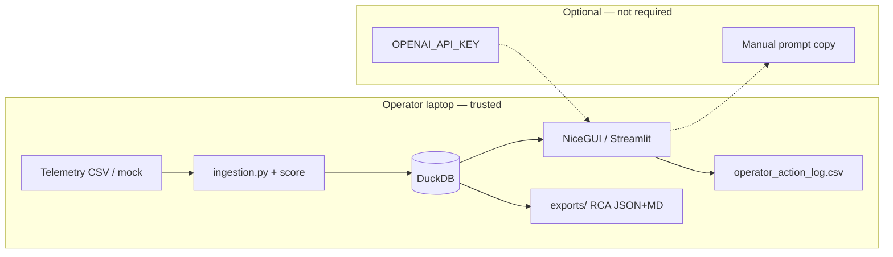

# Threat Model: Mission Autonomy Field Support Console

**Artifact:** Forward-Deployed AI Systems Workbench — Mission Console  
**Version:** 1.0  
**Owner:** FDE-Team-01  
**Last reviewed:** 2026-07-08

## System summary

Local-first operator console for triaging autonomous asset telemetry. Components:

| Component | Path | Exposure |
|---|---|---|
| NiceGUI Mission Console | `src/apps/nicegui_app.py` | `127.0.0.1:8080` (local bind) |
| Streamlit starter | `src/apps/streamlit_app.py` | Local Streamlit port |
| Scoring / ingestion | `src/core/ingestion.py` | In-process only |
| DuckDB store | `artifacts/mission_console.duckdb` | Local filesystem |
| Operator log | `artifacts/operator_action_log.csv` | Local filesystem |
| RCA exports | `artifacts/exports/` | Local filesystem |
| Agent adapters | Codex / Grok Build / Claude Code | Developer workstation |

**Trust boundary:** Operator laptop running the workbench. No required cloud services for core triage.

---

## Assets to protect

1. **Telemetry data** — may reveal asset location, capability, and failure state.
2. **Operator action logs** — attributable human actions and escalation notes.
3. **RCA packets** — engineering handoff with diagnostic conclusions.
4. **API credentials** — `OPENAI_API_KEY` and future model keys in environment only.
5. **Repository integrity** — scoring logic, thresholds, and test gates.

---

## Threat actors

| Actor | Motivation | Capability |
|---|---|---|
| Malicious operator (insider) | Disrupt triage, hide incidents | Local UI + file write access |
| Supply-chain attacker | Poison telemetry CSV upload | File upload to console |
| Network adversary (field) | Exfiltrate data if network enabled | Limited — core path is offline |
| Prompt-injection via AI tab | Mislead operator with bad guidance | Copy/paste prompt export (advisory only) |
| Compromised dev agent | Introduce backdoor via AI-generated code | Repo write via Codex/Grok/Claude |

---

## STRIDE analysis

### Spoofing
| Threat | Risk | Mitigation (current) | Gap |
|---|---|---|---|
| Forged telemetry CSV | Medium | Schema validation in `ingestion.py`; reject missing columns | No cryptographic provenance on uploads |
| Spoofed operator ID in action log | Low | Free-text operator field — organizational policy | No authN on operator identity |

### Tampering
| Threat | Risk | Mitigation (current) | Gap |
|---|---|---|---|
| Modify DuckDB file on disk | Medium | Local FS permissions; gitignored runtime DB | No integrity hash on DB file |
| Alter scoring thresholds in repo | High | Code review, `pytest` + golden regression, `git diff` | No signed releases |
| Tamper with RCA export after generation | Low | Operator controls export timing | No digital signature on packets |

### Repudiation
| Threat | Risk | Mitigation (current) | Gap |
|---|---|---|---|
| Operator denies logged action | Medium | Timestamped CSV append log | No immutable audit chain |
| Engineer cannot trace ingest source | Low | Governance panel + RCA `data_source` field | — |

### Information disclosure
| Threat | Risk | Mitigation (current) | Gap |
|---|---|---|---|
| Secrets committed to git | High | `.gitignore` for `.env`, operator logs, exports; `bandit` in evals | Run `bandit`/`pip-audit` in CI |
| RCA JSON shared over insecure channel | Medium | Operator-controlled export | No encryption at rest for exports |
| Telemetry in AI prompt export | Medium | Prompt export is manual copy; advisory only | Live API would increase blast radius |
| NiceGUI bound to localhost | Low | `host="127.0.0.1"` in `nicegui_app.py` | Re-bind review if deploying to LAN |

### Denial of service
| Threat | Risk | Mitigation (current) | Gap |
|---|---|---|---|
| Large CSV upload exhausts memory | Medium | Starter assumes small files (< few MB) | No row/size cap on upload |
| DuckDB corruption | Low | Single-user local file | No backup/restore procedure |
| pytest failure blocks ship | Low | `./scripts/verify.sh` gate | — |

### Elevation of privilege
| Threat | Risk | Mitigation (current) | Gap |
|---|---|---|---|
| AI agent introduces dependency with network exfil | High | `AGENTS.md` local-first rule; human review | No automated dependency allowlist |
| Streamlit/NiceGUI RCE via dependency CVE | Medium | `pip-audit` recommended in security scorecard | Not in verify.sh yet |

---

## AI-specific threats

| Threat | Description | Control |
|---|---|---|
| **Prompt injection in triage briefs** | Malicious content in telemetry fields copied into exported prompts | Treat AI output as advisory; human approves actions |
| **Hallucinated RCA conclusions** | Model invents failing component not supported by telemetry | RCA packet built from deterministic scoring, not LLM |
| **Agent over-permission** | Grok/Claude/Codex runs destructive shell commands | Permission prompts; sandbox profiles (`--sandbox workspace`) |
| **Ungoverned codegen** | Agent removes tests or adds cloud deps | `AGENTS.md` constraints; `./scripts/verify.sh`; review `git diff` |

---

## Data flow diagram

---

## Security controls checklist

| Control | Status | Owner |
|---|---|---|
| No hardcoded secrets | Implemented | Repo |
| `.env` gitignored | Implemented | Repo |
| Runtime artifacts gitignored | Implemented | Repo |
| Input schema validation | Implemented | `ingestion.py` |
| JSON Schema contracts | Implemented | `src/schemas/` |
| Golden regression tests | Implemented | `tests/golden_outputs/` |
| Security scorecard template | Implemented | `evals/security_scorecard.md` |
| `bandit` / `pip-audit` in verify gate | **Gap** | P3 |
| Upload size / row limits | **Gap** | P3 |
| Operator authN | Out of scope (starter) | — |
| TLS for local UI | N/A (localhost) | — |

---

## Residual risk acceptance (starter)

For portfolio/demo deployment on an operator laptop:

- **Accepted:** No operator authentication; localhost-only binding; manual AI prompt export.
- **Not accepted for production field deploy without:** upload limits, `pip-audit` in CI, immutable audit log, provenance on telemetry ingest.

---

## Review triggers

Re-run this threat model when:

1. Live LLM API calls are wired into the console.
2. NiceGUI is bound beyond `127.0.0.1` or deployed to LAN/WAN.
3. DuckDB ingests untrusted third-party telemetry at scale.
4. A new agent adapter gains always-approve or `--yolo` in CI.
5. RCA packets are auto-transmitted to external ticketing systems.